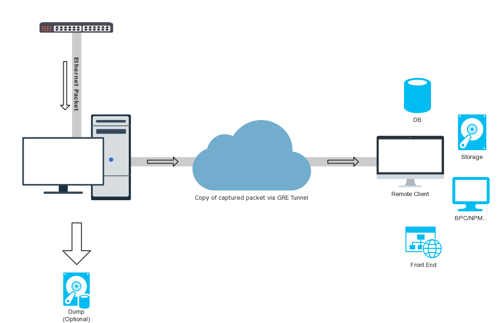

[English](README.md)  ∙  简体中文

# Netis Cloud Probe

[](https://github.com/Netis/cloud-probe/releases/tag/0.3.6)
[](./LICENSE.md)

## 什么是Netis Cloud Probe?
Netis Cloud probe（曾用名 Packet Agent）是一个用于解决如下问题的开源项目：设备A上抓取的数据包，之后在设备B上使用分析。在很多时候，当你希望监控网络的流量，但是并没有可用的设备，例如：
- 物理环境中不存在[TAP](https://en.wikipedia.org/wiki/Network_tap)和[SPAN](http://docwiki.cisco.com/wiki/Internetworking_Terms:_Switched_Port_Analyzer_(SPAN))设备。
- 虚拟环境中，Virtual Switch [Flow Table](https://wiki.openstack.org/wiki/Ovs-flow-logic)不支持SPAN功能。

因此，该项目提供一套低开销但是高性能的抓包工具，用于应对上述困难。
- **cpworker** 该工具可以轻松地在网卡上抓数据包，通过不同的输出方式将数据包发送到远端的设备，从而进行数据包监控和分析。



此外，还有工具：
- **cpdaemon** 是cpworker的管理程序。它可以拉起和停止cpworker。该模块需要和CPM（Cloud Probe Mananger）.CPM提供了用户界面，可以对cpworker的策略进行配置，同时还可以图形化显示cpdaemon上报的统计数据。您可以联系Netis获取关于CPM的进一步支持，或者可以开发自己的CPM。

## 快速开始

### 通过libpcap抓包，用GRE头进行封装并发送到远端设备
备注：请确保防火墙允许向目标发送GRE数据包.
https://lartc.org/howto/lartc.tunnel.gre.html 提供验证是否允许向目标发送GRE数据包的方法.

新建配置文件，比如：`libpcap_gre.json`
```json
{
    "log_level": "INFO",
    "control": {
        "type": "unix",
        "unix": {
            "path": "/var/run/cloud-probe/cpworker.sock"
        }
    },
    "tasks": [
        {
            "req_pattern": {
                "type": "auto"
            },
            "capturer": {
                "type": "libpcap",
                "libpcap": {
                    "interface": "eth0",
                    "snaplen": 2048,
                    "buffer_size_mb": 256
                }
            },
            "outputs": [
                {
                    "type": "gre",
                    "gre": {
                        "host": "172.16.1.201",
                        "bind_device": "eth1"
                    }
                }
            ]
        }
    ]
}
```

执行命令:

```bash
cpworker -c libpcap_gre.json
```

完整的使用说明，请参阅[这篇文档](./docs/USAGE-zh-Hans.md).


## 文档/ 链接
* [安装](./docs/INSTALL-zh-Hans.md)
* [使用](./docs/USAGE-CPWORKER-zh-Hans.md)
* [构建条件和步骤](./docs/BUILD-zh-Hans.md)

## 贡献
您可以fork本项目并提交Pull Request。我们欢迎所有开源社区的同学提交自己的贡献。

## 支持
本项目提供给具备开发能力的团队使用，官方不承诺提供支持。详情参见 [SUPPORT-zh-Hans.md](./SUPPORT-zh-Hans.md)。

## 许可证
Copyright (c) 2018 - 2020 Netis.

本项目库遵循下列许可证：
- [BSD-3-Clause](./LICENSE.md).

## 联系方式
* 您可以给我们发邮件到[developer@netis.com](mailto:developer@netis.com)。
* 您也可以在[GitHub issues](https://github.com/Netis/cloud-probe/issues)直接报告问题和建议。

## issue模板
* 在您提出issue时，请使用该模板 （[issue_report_template_Chinese.md](.github/ISSUE_TEMPLATE/issue_report_template_Chinese.md)）
