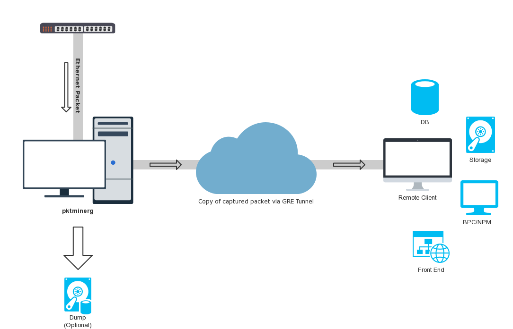
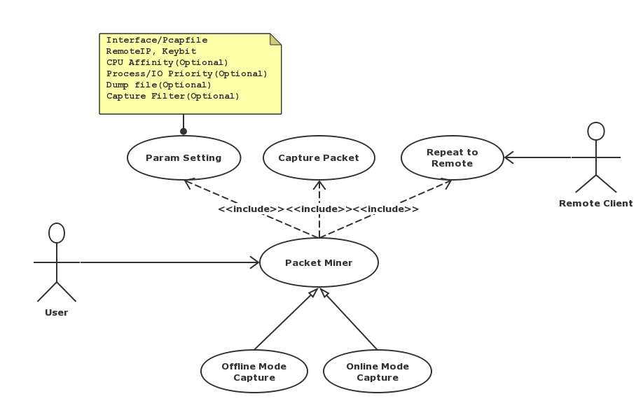

English  ∙  [简体中文](README-zh-Hans.md) 


# Netis Packet Agent 0.5.0

[](https://github.com/Netis/packet-agent/releases/tag/0.5.0)
[](./LICENSE.md)

## What is Netis Packet Agent?
Netis Packet Agent is an open source project to deal with such situation: it captures packets on *Machine A* but has to use them on *Machine B*. This case is very common when you try to monitor network traffic in the [LAN](https://en.wikipedia.org/wiki/Local_area_network) but the infrastructure is incapable, for example
- There is neither [TAP](https://en.wikipedia.org/wiki/Network_tap) nor [SPAN](http://docwiki.cisco.com/wiki/Internetworking_Terms:_Switched_Port_Analyzer_(SPAN)) device in a physical environment.
- The Virtual Switch [Flow Table](https://wiki.openstack.org/wiki/Ovs-flow-logic) does not support SPAN function in a virtualization environment.

Also, this project aims at developing a suite of low cost but high efficiency tools to survive the challenge above.
- **pktminerg** is the very first one, which makes you easily capture packets from an NIC interface, encapsulate them with GRE and send them to a remote machine for monitoring and analysis.




With 3 utilities:
- **pcapcompare** is a utility for comparing 2 different pcap files.
- **gredump** is used for capturing GRE packet with filter, and save them to pcap file.
- **gredemo** is a demo app which is used to read packet from a pcap file and send them all to remote NIC. This can be only used when built from source code.


## Getting Started
### Installation

#### CentOS 6/7 and RedHat 7
1. Install libpcap and wget
```bash
yum install libpcap wget zeromq
```

2. Download and install the RPM package. Find the latest package from [Releases Page](https://github.com/Netis/packet-agent/releases).
```bash
wget https://github.com/Netis/packet-agent/releases/download/v0.5.0/netis-packet-agent-0.5.0.el6.x86_64.rpm
rpm -ivh netis-packet-agent-0.5.0.el6.x86_64.rpm
```

#### SUSE 12
1. Download and install the RPM package. Find the latest package from [Releases Page](https://github.com/Netis/packet-agent/releases).
```bash
wget https://github.com/Netis/packet-agent/releases/download/v0.5.0/netis-packet-agent-0.5.0.el6.x86_64.rpm
rpm -ivh netis-packet-agent-0.5.0.el6.x86_64.rpm
```


#### Ubuntu 18.04LTS
1. Install libpcap and wget
```bash
sudo apt-get install libpcap-dev wget
```

2. Download and install the DEB package. Find the latest package from [Releases Page](https://github.com/Netis/packet-agent/releases).
```bash
wget https://github.com/Netis/packet-agent/releases/download/v0.5.0/netis-packet-agent-0.5.0_amd64.deb
sudo dpkg -i netis-packet-agent-0.5.0_amd64.deb
```

3. If libpcap.so.1 not found when running pktminerg, create softlink for libpcap.so.1 in suitable directory.
```bash
whereis libpcap.so
cd /path/to/libpcap.so
ln -s libpcap.so.x.y.z libpcap.so.1
```

Remarks: If it encounter a library dependency error when install from rpm, you should install boost_1_59_0 or later. If this also can't work, you can build and run from source.

Remarks: Now only support CentOS 6/7, RedHat 7, SUSE 12, Ubuntu 18.04 LTS.

#### Windows 7/8/10 x64
1. Download and Install [Winpcap](https://www.winpcap.org/install/bin/WinPcap_4_1_3.exe) of latest version. 
2. Download and Install [Microsoft Visual C++ Redistributable for Visual Studio 2017 x64](https://aka.ms/vs/15/release/vc_redist.x64.exe).
3. Extract pktminerg and other utilities from zip,  and run it in cmd in Administrator Mode.

Note: On Windows platform, you must use NIC's NT Device Name with format "\Device\NPF_{UUID}" as interface param. You can get it with following command: 
```
    C:\> getmac /fo csv /v 
    "Connection Name","Network Adapter","Physical Address","Transport Name" 
    "Ethernet","Intel(R) Ethernet Connection (4) I219-V","8C-16-45-6B-53-B5","\Device\Tcpip_{4C25EA92-09DF-4FD3-A8B3-1B68E57443E2}" 
``` 
Take last field(Transport Name) and replace "Tcpip_" with "NPF_" as follow, then you can get interface param of Windows. 
```
    \Device\NPF_{4C25EA92-09DF-4FD3-A8B3-1B68E57443E2} 
``` 
Use example:
```
    C:\> pktminerg -i \Device\NPF_{4C25EA92-09DF-4FD3-A8B3-1B68E57443E2} -r 172.24.103.201 
    C:\> gredump -i \Device\NPF_{4C25EA92-09DF-4FD3-A8B3-1B68E57443E2} -o capture.pcap
```


## Engineering team contacts
* [E-mail us.](mailto:developer@netis.com)
<br>

### Usage
Remarks: Make sure the firewall allows GRE packets to be sent to the target.
https://lartc.org/howto/lartc.tunnel.gre.html provides a way to check firewall allows GRE packets to be sent.
```bash
# Capture packet from NIC "eth0", encapsulate with GRE header and send to 172.16.1.201
pktminerg -i eth0 -r 172.16.1.201

# Specify cpu 1 for this program with high priority to avoid thread switch cost.
pktminerg -i eth0 -r 172.16.1.201 --cpu 1 -p

# compare 2 pcap files
pcapcompare --lpcap /path/to/left_file.pcap --rpcap /path/to/right_file.pcap

# Capture packet from NIC "eth0" and save them to gredump_output.pcap
gredump -i eth0 -o /path/to/gredump_output.pcap

# Capture packet from NIC "eth0", do not set DF flag
pktminerg -i eth0 -r 172.16.1.201 -M dont
```



For more information on using these tools, please refer to this [document](./USAGE.md).

For docker usage, please refer to this [document](./DOCKER.md).

### Build from source.
You can also clone source from Github and build Netis Packet Agent in local, then check"/path/to/packet-agent/bin" to find all binary.
<br/>
For build precondition and steps, please refer to this [document](./BUILD.md).

## Documentation / Useful link
* [Installation](./INSTALL.md) and [Usage](./USAGE.md).
* [Build requirements and steps](./BUILD.md).
* [Release Information / Roadmap](./CHANGES.md).

## Contributing
Fork the project and send pull requests. We welcome pull requests from members of all open source community.

## License
Copyright (c) 2018 - 2020 Netis.<br/>
The content of this repository bound by the following licenses:
- The computer software is licensed under the [BSD-3-Clause](./LICENSE.md).

## Contact info
* You can E-mail to [developer@netis.com](mailto:developer@netis.com).
* You can also report issues and suggestions via [GitHub issues](https://github.com/Netis/packet-agent/issues).

<br/>
