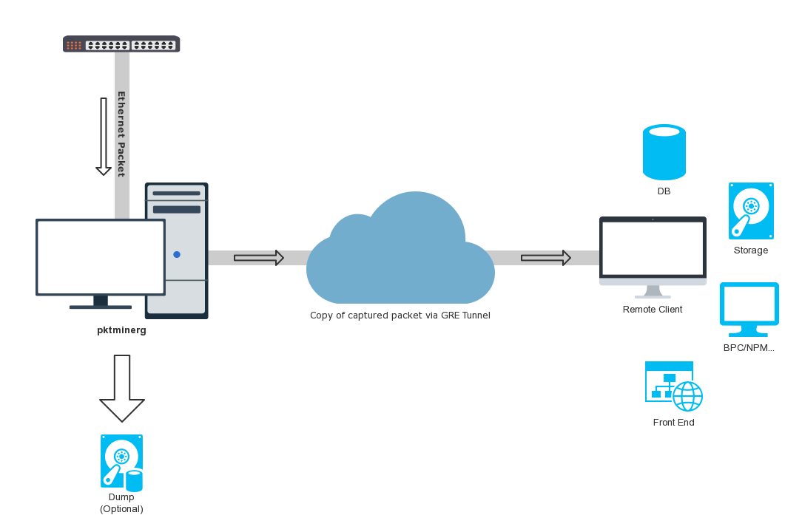

English  ∙  [简体中文](README-zh-Hans.md)


# Netis Cloud Probe

[](https://github.com/Netis/packet-agent/releases/tag/0.3.6)
[](./LICENSE.md)

## What is Netis Cloud Probe?
Netis Cloud Probe (Packet Agent, name used before)is an open source project to deal with such situation: it captures packets on *Machine A* but has to use them on *Machine B*. This case is very common when you try to monitor network traffic in the [LAN](https://en.wikipedia.org/wiki/Local_area_network) but the infrastructure is incapable, for example
- There is neither [TAP](https://en.wikipedia.org/wiki/Network_tap) nor [SPAN](http://docwiki.cisco.com/wiki/Internetworking_Terms:_Switched_Port_Analyzer_(SPAN)) device in a physical environment.
- The Virtual Switch [Flow Table](https://wiki.openstack.org/wiki/Ovs-flow-logic) does not support SPAN function in a virtualization environment.

Also, this project aims at developing a suite of low cost but high efficiency tools to survive the challenge above.
- **cpworker** which makes you easily capture packets from an NIC interface, encapsulate them with GRE and send them to a remote machine for monitoring and analysis.




With utilities:
- **cpdaemon** which is responsible for the management of the cpworker process. It can pull and kill cpworker process and set the parameters of cpworker in the command line. This module should work with CPM (Cloud Probe Manager)，which provides a user interface to set the strategies of cpworker and can also display the statistis reported from cpworker in graphs. You can contact Netis for the further support of CPM, or you can also develop your CPM.


## Getting Started

### Usage
Remarks: Make sure the firewall allows GRE packets to be sent to the target.
https://lartc.org/howto/lartc.tunnel.gre.html provides a way to check firewall allows GRE packets to be sent.

new config file `libpcap_gre.json`
```json
{
    "tasks": [
        {
            "interface": "eth0",
            "snaplen": 2048,
            "req_pattern": {
                "type": "auto"
            },
            "capturer": {
                "type": "libpcap",
                "libpcap": {
                    "buffer_size_mb": 256
                }
            },
            "outputs": [
                {
                    "type": "gre",
                    "rate_limit_mbps": 10,
                    "gre": {
                        "host": "172.16.1.201",
                        "bind_device": "eth1"
                    }
                }
            ]
        }
    ]
}
```

run command:

```bash
cpworker -c libpcap_gre.json
```

## Documentation / Useful link
* [Build requirements and steps](./BUILD.md).

## Contributing
Fork the project and send pull requests. We welcome pull requests from members of all open source community.

## Support
This project is provided to teams with development capabilities, and there is no official commitment to provide support. For details see [SUPPORT.md](./SUPPORT.md)。

## License
Copyright (c) 2018 - 2020 Netis.

The content of this repository bound by the following licenses:
- The computer software is licensed under the [BSD-3-Clause](./LICENSE.md).

## Contact info
* You can E-mail to [developer@netis.com](mailto:developer@netis.com).
* You can also report issues and suggestions via [GitHub issues](https://github.com/Netis/packet-agent/issues).
## Issue template
* if you have any issue to report, please use the issue template provided([issue_report_template_English.md](https://github.com/Netis/cloud-probe/blob/master/issue_report_template_English.md)).
