# Packet-Agent 性能评测

# 测试环境与方法

pktminerg version 0.3.2 (rev: 7d844a7 build: 2019-01-21 10:27:50)
libpcap version 1.5.3

阿里云华东区和aws香港区机器

使用tcpreplay往网卡发包，pktminerg从网卡抓包封装后发出。

# 阿里云性能图表

|     | 2 cpu | 8 cpu | 12 cpu |
|-----|-------|-------|--------|
|通用型 centos7.6|内存占用 508.8 M 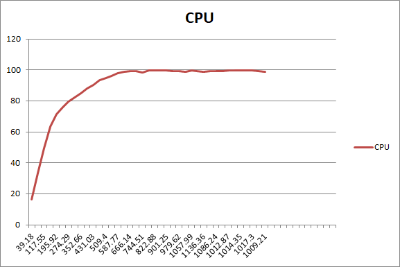|内存占用 508.8 M 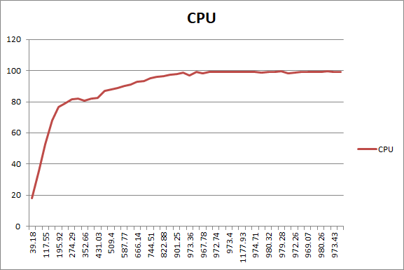|内存占用 508.8 M |
|高主频 centos7.6|内存占用 508.8 M 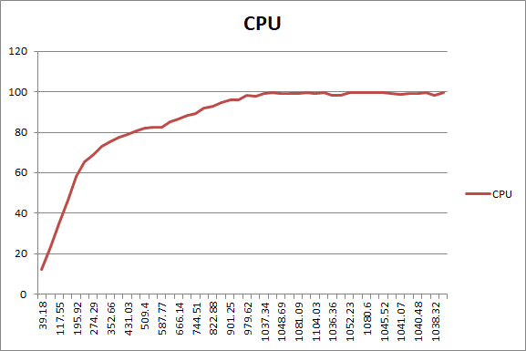|内存占用 508.8 M 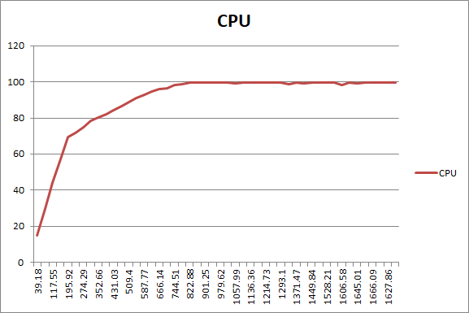|内存占用 508.8 M 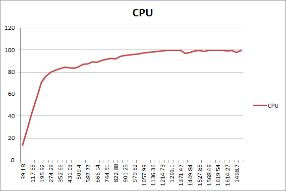|
|通用型 suse12.2|内存占用：280.2 M。CPU顶峰：90.3%，1175.5 Mbps 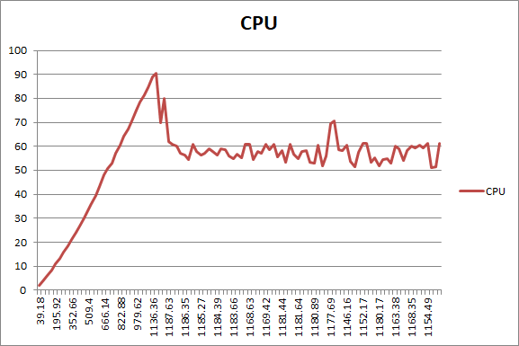|内存占用：280.2 M 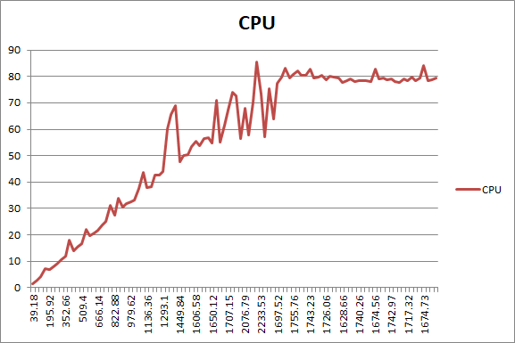|内存占用：280.2 M 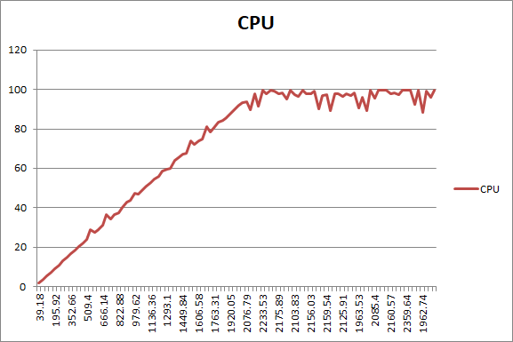|
|高主频 suse12.2|内存占用：280.2 M。CPU顶峰：97.47%，1175.5 Mbps 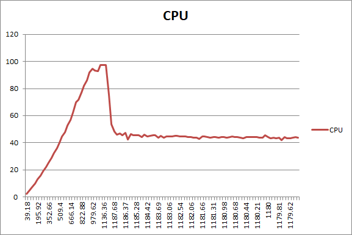|内存占用：280.2 M 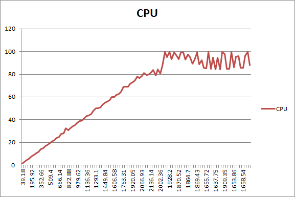|内存占用：280.2 M 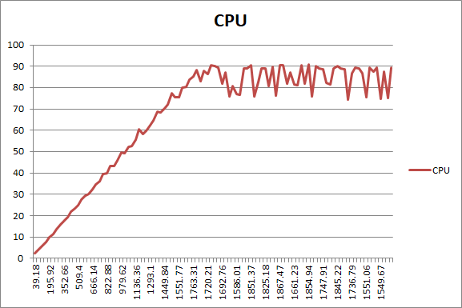|

# 阿里云机器配置

|规格族|实例规格|vCPU|内存|处理器型号|处理器主频|内网带宽|内网收发包|支持 IPv6|
|--|--|--|--|--|--|--|--|--|
|通用型 g5|ecs.g5.large|2 vCPU|8 GiB|Intel Xeon(Skylake) Platinum 8163|2.5 GHz|1 Gbps|30 万 PPS|是|
|通用型 g5|ecs.g5.2xlarge|8 vCPU|32 GiB|Intel Xeon(Skylake) Platinum 8163|2.5 GHz|2.5 Gbps|80 万 PPS|是|
|通用型 g5|ecs.g5.3xlarge|12 vCPU|48 GiB|Intel Xeon(Skylake) Platinum 8163|2.5 GHz|4 Gbps|90 万 PPS|是|
||||||||||
|高主频通用型 hfg5|ecs.hfg5.large|2 vCPU|8 GiB|Intel Xeon Gold 6149|3.1 GHz|1 Gbps|30 万 PPS|否|
|高主频通用型 hfg5|ecs.hfg5.2xlarge|8 vCPU|32 GiB|Intel Xeon Gold 6149|3.1 GHz|2 Gbps|100 万 PPS|否|
|高主频通用型 hfg5|ecs.hfg5.3xlarge|12 vCPU|48 GiB|Intel Xeon Gold 6149|3.1 GHz|2.5 Gbps|130 万 PPS|否|

# AWS性能图表

|     | 2 cpu | 8 cpu | 12 cpu |
|-----|-------|-------|--------|
|通用型 centos7.6|内存占用 508.8 M |内存占用 508.8 M 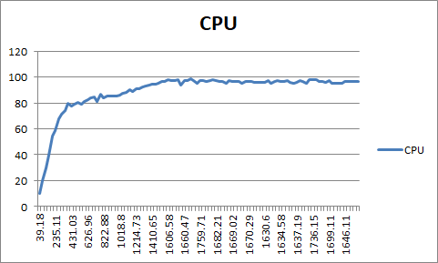|内存占用 508.8 M 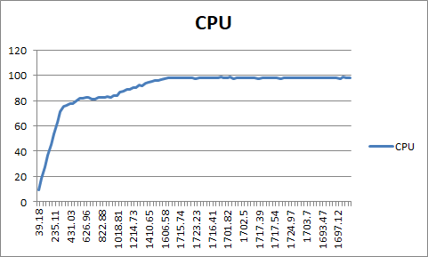|
|高主频 centos7.6|内存占用 508.8 M 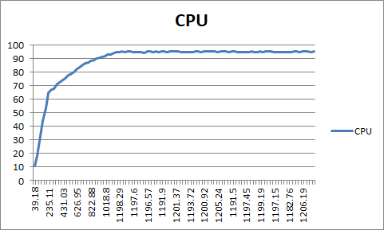|内存占用 508.8 M 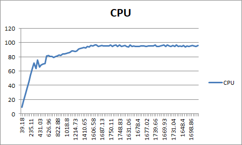|内存占用 508.8 M 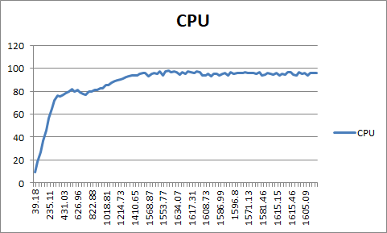|
|通用型 suse12.2|内存占用：280.2 M 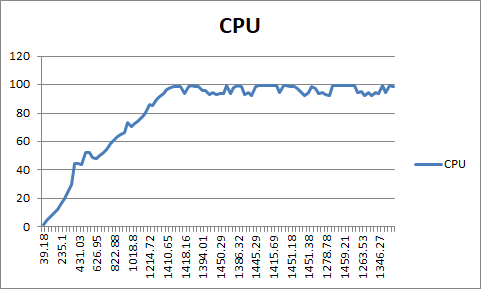|内存占用：280.2 M 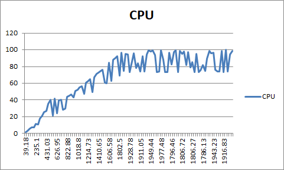|内存占用：280.2 M 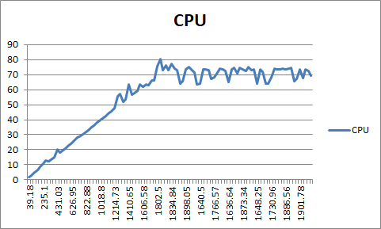|
|高主频 suse12.2|内存占用：280.2 M 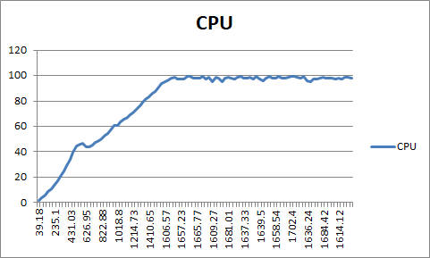|内存占用：280.2 M 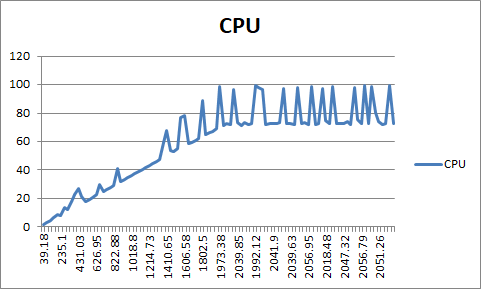|内存占用：280.2 M 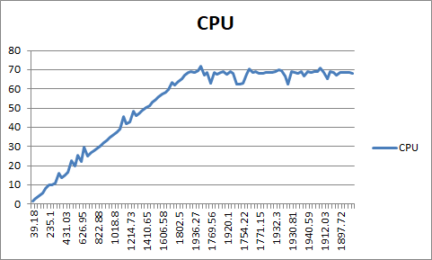|

# aws机器配置

|系列|类型|vCPU|内存 (GiB)|处理器|实例存储 (GB)|可用的优化 EBS|网络性能|IPv6 支持|
|--|--|--|--|--|--|--|--|--|
|通用型|m5.large|2|8|Intel(R) Xeon(R) Platinum 8175M CPU @ 2.50GHz|仅限于 EBS|是|高达 10Gb|是|
|通用型|m5.2xlarge|8|32|Intel(R) Xeon(R) Platinum 8175M CPU @ 2.50GHz|仅限于 EBS|是|高达 10Gb|是|
|通用型|m5.4xlarge|16|64|Intel(R) Xeon(R) Platinum 8175M CPU @ 2.50GHz|仅限于 EBS|是|高达 10Gb|是|
||||||||||
|计算优化|c5.large|2|4|Intel(R) Xeon(R) Platinum 8124M CPU @ 3.00GHz|仅限于 EBS|是|高达 10Gb|是|
|计算优化|c5.2xlarge|8|16|Intel(R) Xeon(R) Platinum 8124M CPU @ 3.00GHz|仅限于 EBS|是|高达 10Gb|是|
|计算优化|c5.4xlarge|16|32|Intel(R) Xeon(R) Platinum 8124M CPU @ 3.00GHz|仅限于 EBS|是|高达 10Gb|是|