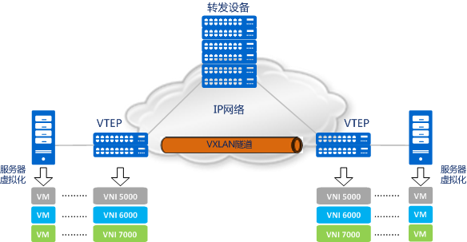
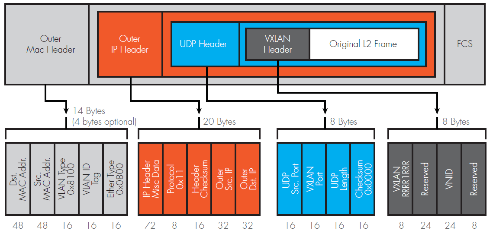
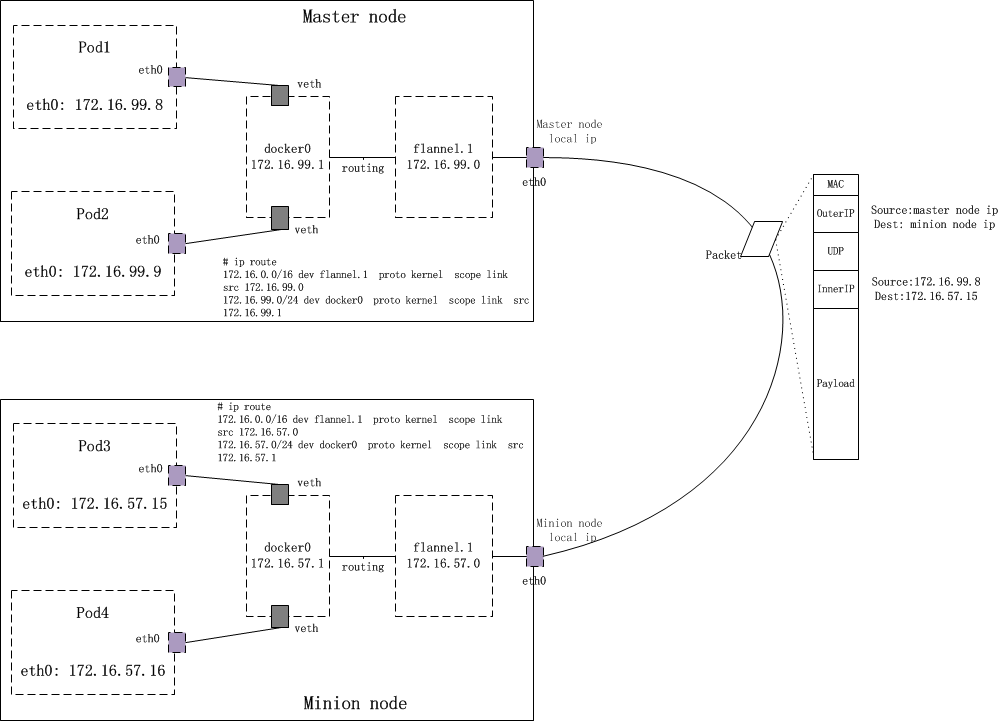

&ensp;&ensp;&ensp;&ensp;Kubernetes作为出色的容器化应用部署方案，目前已经得到了广泛的应用。在数据监控领域，网络流量镜像及数据包分析的容器化，也是未来的发展趋势。例如，通过和packet-agent的协同使用，可在Pod内部实现远程流量镜像及保存。packet-agent是Netis开发的一款开源工具，基于libpcap库，用于网络流量镜像及分发。可以运行于物理主机、虚拟机、Docker容器等云环境，通过指定抓包的网络接口及远端IP，即可将抓到的数据包复制一份，通过任意一种隧道协议发送至远端IP指定的接收主机。目前，packet-agent通过插件化的机制支持了Standard GRE, ERSPAN Type I/II/III, VxLAN等隧道协议，以及NetFlow流量分析协议V1/5/7。

&ensp;&ensp;&ensp;&ensp;Kubernetes默认采用Flannel网络架构。Flannel本质上是一种Overlay Network,底层默认采用UDP + Vxlan协议，因此在理论上，POD容器可以作为packet-agent流量镜像包的目的地。本文将探讨packet-agent + 基于K8S Flannel网络的POD流量分析解决方案。

## 0x01 VxLAN网络协议

&ensp;&ensp;&ensp;&ensp;虚拟局域网扩展（Virtual Extensible LAN, VXLAN）是一种网络虚拟化技术，它试图改善云计算部署相关的可扩展性问题。它采用类似VLAN封装技术封装基于MAC含括第 4 层的UDP数据包的 OSI 第2层 以太网帧 ，使用 4789 作为默认分配的 IANA 目的地 UDP 端口号。
同传统的VLAN相比，VxLAN具有如下优点：
* 虚拟化（虚拟机和容器）的兴起使得一个数据中心会有成千上万的机器需要通信，而传统的 VLAN 技术只能支持 4096 个网络上限，已经满足不了不断扩展的数据中心规模。VXLAN Network Identifier采用24位标识，上限可扩展到16,777,216。
* 越来越多的数据中心（尤其是公有云服务）需要提供多租户的功能，不同用户之间需要独立地分配 ip 和 MAC 地址，如何保证这个功能的扩展性和正确性也是一个待解决的问题
* 云计算业务对业务灵活性要求很高，虚拟机可能会大规模迁移，并保证网络一直可用，也就是大二层的概念。解决这个问题同时保证二层的广播域不会过分扩大，也是云计算网络的要求

&ensp;&ensp;&ensp;&ensp;传统二层+三层的网络在应对这些要求时变得力不从心，虽然很多改进型的技术比如堆叠、SVF、TRILL 等能够增加二层的范围，努力改进经典网络，但是要做到对网络改动小同时保证灵活性高却非常困难。

&ensp;&ensp;&ensp;&ensp;下两张图是VxLAN的网络架构，和VxLAN数据包的格式。VxLAN是一种隧道协议，在UDP之上封装8字节的VxLAN头部，头部包含了VNI（VXLAN Network Identifier）用于标识该数据包内层包所在虚拟网络标识。VTEP则相当于VxLAN Overlay Network的网关，负责报文的封包及解包。更加详细的协议内容可以参考RFC7348，这里不做展开。




&ensp;&ensp;&ensp;&ensp;因此，从报文格式可以看到，要完整组装报文，正常进行报文转发从而完成一次VxLAN的数据包交互，需要：
* 指定当前虚拟网络的ID（VNI），这个可以通过手动配置完成。
* 目的VTEP后虚拟网络里的主机MAC地址，毕竟VTEP解包后依然要通过链路层传递报文。
* VTEP在承载网络（外层网络）的IP地址。

&ensp;&ensp;&ensp;&ensp;如果不采用主从模式的架构，则需要多播协议，进行发现，以及路由表、ARP表、FDB等的构建。此时VTEP可以充当MAC地址学习及FDB构建、ARP报文转发。但是缺点也是对等网络所具有的缺陷：效率低、网络流量泛滥，很多无效的组播包将导致网络拥塞。

&ensp;&ensp;&ensp;&ensp;因此，基于多播的VxLAN网络初始化目前很少使用。在K8S Flannel网络等虚拟化容器中，一般采用分布式网络控制中心的方式：控制中心保存了虚拟主机的IP/MAC（在主机启动之前就已确定），以及VTEP列表。而在VTEP上则运行着agent进程，负责和控制中心通信，从控制中心获取MAC/IP/VNI等信息，例如Flannel网络架构中的etcd和flanneld守护进程。

## 0x02 K8S Flannel网络通信原理

&ensp;&ensp;&ensp;&ensp;Kubernetes通过flannel、calic等网络插件解决Pod间的通信问题，flannel是kubernetes默认提供网络插件。Flannel是由CoreOs团队开发社交的网络工具，CoreOS团队采用L3 Overlay模式设计flannel， 规定宿主机下各个Pod属于同一个子网，不同宿主机下的Pod属于不同的子网。

&ensp;&ensp;&ensp;&ensp;flannel会在每一个宿主机上运行名为flanneld代理，其负责为宿主机预先分配一个子网，并为Pod分配IP地址。Flannel使用Kubernetes或etcd来存储网络配置、分配的子网和主机公共IP等信息。数据包则通过VXLAN、UDP或host-gw这些类型的后端机制进行转发。

* flannel默认使用etcd作为配置和协调中心，首先使用etcd设置集群的整体网络。
* 基于在etcd中设置的网络，flannel为每一个Node分配IP子网。
* flannel在每个Node上启动了一个flanneld的服务，在flanneld启动后，将从etcd中读取配置信息，并请求获取子网的租约。所有Node上的flanneld都依赖etcd cluster来做集中配置服务，etcd保证了所有node上flanned所看到的配置是一致的。同时每个node上的flanned监听etcd上的数据变化，实时感知集群中node的变化。flanneld一旦获取子网租约、配置后端后，会将一些信息写入/run/flannel/subnet.env文件。
* 在Node节点上，会创建一个名为flannel.1的虚拟网卡。
* 为容器配置名为docker0的网桥，实际是通过修改Docker的启动参数–bip来实现的。通过这种方式，为每个节点的Docker0网桥设置在整个集群范围内唯一的网段，从保证创建出来的Pod的IP地址是唯一。
* flannel会对路由表进行修改，从而能够实现容器跨主机的通信。

&ensp;&ensp;&ensp;&ensp;下图是Flannel网络拓扑的一个例子(来源网络)。其中共有两个Node宿主机，可以是物理主机或者虚拟主机。



&ensp;&ensp;&ensp;&ensp;数据包从Master Node的pod1 发送到Minion Node的pod3的流程如下：
* 通过查找路由表，包首先被转发至Master Node的网桥docker0上。
* docker0收到数据包后，其内核栈处理程序会读取这个数据包的目标地址，根据目标地址将数据包发送给下一个路由节点：flannel.1。
* flannel.1收到数据后，flanneld守护进程会将数据包封装成二层以太包。源MAC:Master Node上的flannel.1虚拟网卡的MAC地址；目的MAC:Monion Node上的flannel.1虚拟网卡的MAC地址，并添加VxLAN头。
* 由于目前的数据包只是vxlan tunnel上的数据包，因此还不能在物理网络上进行传输。因此，需要将上述数据包作为payload再次进行封装为UDP包，填充好外层的IP头和MAC头（宿主机的IP和MAC），才能源容器节点传输到目标容器节点，这项工作在由linux内核来完成。之后从宿主机Master Node的eth0端口发送出去。
* 目标容器宿主机的eth0接收到数据后，对数据包进行拆封，并转发给flannel.1虚拟网卡；
* flannel.1 虚拟网卡接受到数据，将数据发送给docker0网桥；
* 数据到达目标容器，完成容器之间的数据通信。

&ensp;&ensp;&ensp;&ensp;如上一节所述，所有的ARP表，FDB，路由表构建交由flanneld和etcd打理，由flanneld负责捕获内核的L3 miss/L2 miss事件，并返回从etcd查询获取的结果。


## 0x03 用开启VxLAN及Netflow插件的packet-agent替换flanneld

&ensp;&ensp;&ensp;&ensp;packet-agent经典模式采用标准GRE协议，可以指定key。
```bash
# Capture packet from NIC "eth0", encapsulate with GRE header and send to 172.16.1.201 with gre key = 3
pktminerg -i eth0 -r 172.16.1.201 -k 3
```
&ensp;&ensp;&ensp;&ensp;在插件模式下，可以提供更多的隧道协议，其中包括VxLAN协议。那么，在源端宿主机作为代理替换flanneld就成为了可能，同时启用Netflow插件，可以直接截获源POD送出的数据包的基础上进行CFLOW分析统计。更进一步，可以在宿主机通过pcap回放，模拟源端POD的数据包。下面是一个例子：

```bash
# 开启VxLAN
# remoteips是远端宿主机IP
JSON_STR=$(cat << EOF
{
    "ext_file_path": "libproto_vxlan.so",
    "ext_params": {
        "remoteips": [
            "10.1.1.37"   
        ],
        "bind_device": "eth0",
        "pmtudisc_option": "dont",
        "use_default_header": false,
        "vni": 3310
    }
}
EOF
)
# 开启NetFlow
# collectors_ipport是用于NetFlow监控的主机和端口
MON_STR=$(cat << EOF
{
    "ext_file_path": "libmonitor_netflow.so",
    "ext_params": {
        "collectors_ipport": [
            {
                "ip": "140.2.6.8",   
                "port": 2055
            },
            {
                "port": 2055
            }
        ],
        "netflow_version": 5
    }
}
EOF
)
./pktminerg -i veth --proto-config "${JSON_STR}" --monitor-config "${MON_STR}"
```
&ensp;&ensp;&ensp;&ensp;此外，可以在离线模式下模拟源POD的流量：
```bash
JSON_STR=$(cat << EOF
{
    "ext_file_path": "libproto_vxlan.so",
    "ext_params": {
        "remoteips": [
            "10.1.1.37"   
        ],
        "bind_device": "eth0",
        "pmtudisc_option": "dont",
        "use_default_header": false,
        "vni": 3310
    }
}
EOF
)
./pktminerg -f pod1.pcap --proto-config "${JSON_STR}" 
```


<br/><br/><br/>

### 参考文献
* [VxLAN协议原理简介](https://cizixs.com/2017/09/25/vxlan-protocol-introduction/)
* [RFC7348](https://tools.ietf.org/html/rfc7348)
* [Kubernetes: Flannel networking](https://blog.laputa.io/kubernetes-flannel-networking-6a1cb1f8ec7c)
* [Kubernetes Concepts: Cluster Networking](https://kubernetes.io/docs/concepts/cluster-administration/networking/)
* [Netis Packet Agent : A toolset for network packet capture, forwarding and analysis via GRE/Cloud.
](https://github.com/Netis/packet-agent)